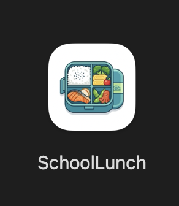

# 급식지도 자동 배치 시스템


교사 시간표 Excel 파일을 읽어서 급식지도 담당 교사를 자동 배정하는 Java Swing 데스크톱 앱입니다.

현재 구조는 `Maven`에서 `Gradle Wrapper` 중심으로 정리되어 있고, 네이티브 패키징은 `jpackage`를 사용합니다. 웹 앱이 아니므로 `Tauri`는 현재 필요하지 않습니다.

## 핵심 기능

- 시간표 Excel 분석
- 4교시 공강 교사 선별
- 급식일 선택
- 자동 배치
- 장소별/교사별 통계
- Excel 결과 저장

## 현재 빌드 구조

- 빌드 도구: `Gradle Wrapper`
- UI: `Java Swing`
- 패키징: `jpackage`
- 실행 진입점: `com.school.lunch.Main`

`pom.xml`과 별도 웹 프로토타입이던 `index.html`은 제거했습니다. 현재 기준 배포 경로와 연결되지 않았기 때문입니다.

## 요구 사항

- JDK 21 이상
- `jpackage`가 포함된 JDK

참고:

- 소스 컴파일 타깃은 Java 17입니다.
- 로컬에서는 JDK 21로 빌드/패키징하도록 구성했습니다.

## 실행

macOS / Linux:

```bash
./gradlew run
```

Windows:

```bat
gradlew.bat run
```

## 빌드

일반 빌드:

macOS / Linux:

```bash
./gradlew build
```

Windows:

```bat
gradlew.bat build
```

배포용 실행 폴더 생성:

macOS / Linux:

```bash
./gradlew installDist
```

Windows:

```bat
gradlew.bat installDist
```

## 네이티브 패키징



macOS `.dmg`:

```bash
./gradlew packageDmg
```

Windows `.exe`:

```bat
gradlew.bat packageExe
```

현재 OS에 맞는 패키지:

macOS / Linux:

```bash
./gradlew packageNative
```

Windows:

```bat
gradlew.bat packageNative
```

산출물 위치:

- 일반 빌드: `build/`
- 네이티브 패키지: `build/jpackage/output/`

## 아이콘 설정

빌드 아이콘은 리소스 폴더 기준으로 연결되어 있습니다.

- macOS: `src/main/resources/icon.png` -> 빌드 시 `.icns`로 변환 후 `dmg`에 사용
- Windows: `src/main/resources/icon.ico` -> `exe`에 사용
- 앱 실행 아이콘: `src/main/resources/icon.png`

## 지워도 되는 폴더

다음 폴더는 삭제해도 됩니다.

- `build/`
- `.gradle-home/`

의미:

- `build/`: 빌드 산출물
- `.gradle-home/`: 로컬 Gradle 캐시

삭제 후 다시 빌드하면 자동으로 재생성됩니다. 다만 처음 한 번은 Gradle 배포본과 의존성을 다시 받아야 하므로 인터넷 연결이 필요할 수 있습니다.

## 다시 설치 / 다시 받기

이 프로젝트는 전역 Gradle 설치 없이 `Gradle Wrapper`만으로 동작합니다. 보통은 아래 명령만 쓰면 됩니다.

macOS / Linux:

```bash
./gradlew build
```

Windows:

```bat
gradlew.bat build
```

## 전역 Gradle 설치 명령

이 프로젝트에는 필수는 아니지만, 시스템 전체에서 `gradle` 명령을 쓰고 싶다면 아래처럼 설치할 수 있습니다.

macOS:

```bash
brew install gradle
```

또는:

```bash
sdk install gradle
```

**Windows** :

Chocolatey:

```powershell
choco install gradle -y
```

Scoop:

```powershell
scoop install gradle
```

설치 확인:

```bash
gradle -v
```
